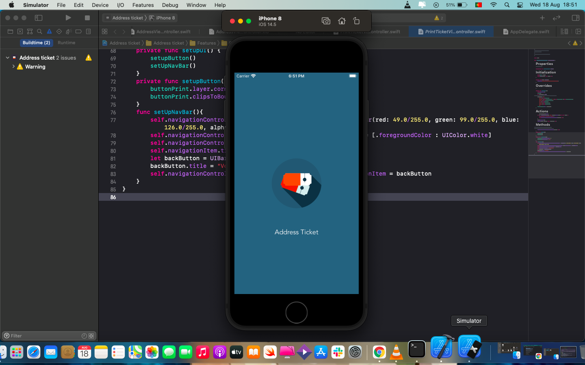
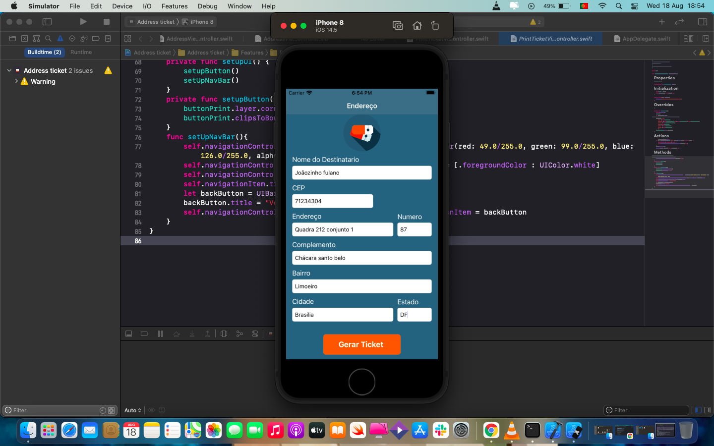
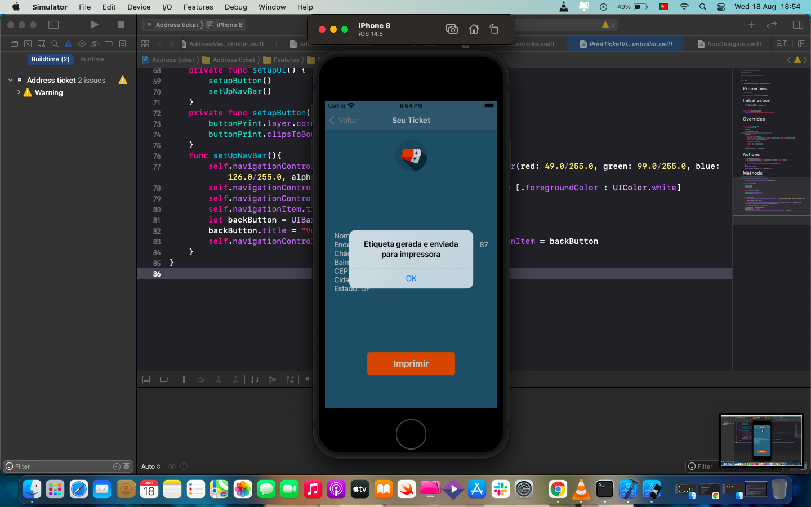

# Address-ticket

## App Desenvolvido em Swift.

### Funções presentes no App:

### O addres Ticket é um app feito baseado em um desafio, onde o proposito é criar um app que gere um ticket de endereço com as informações deixadas nos textfields (Com algumas validações), em seguida levar o usuario para outra tela exibindo as informações e ao precionar o botão é gerado um toast falando que o ticket foi mandado para a impressora.

# Capturas de Tela da Aplicação

## Tela de Loading

## Tela do Formulario

## Tela do Ticket

